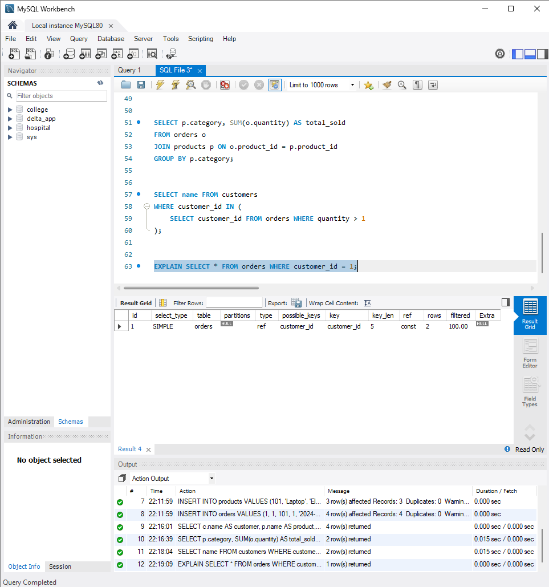
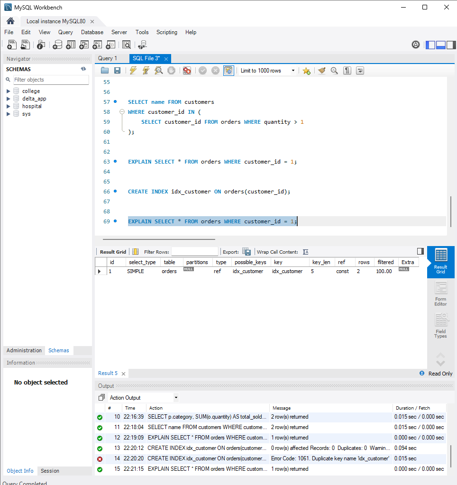
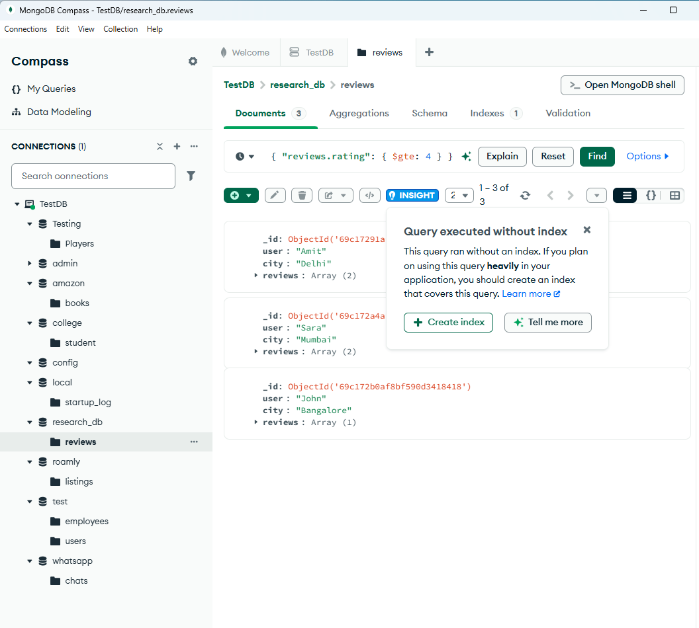
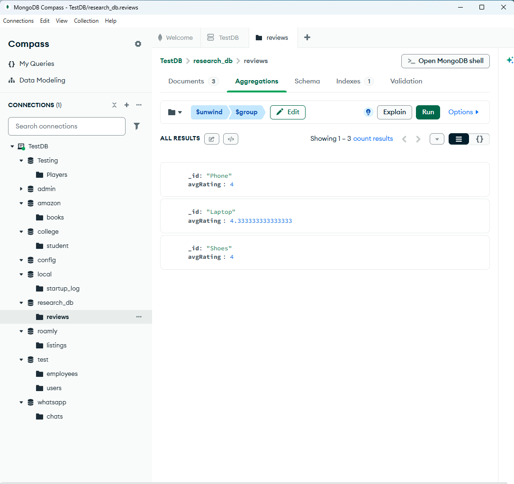
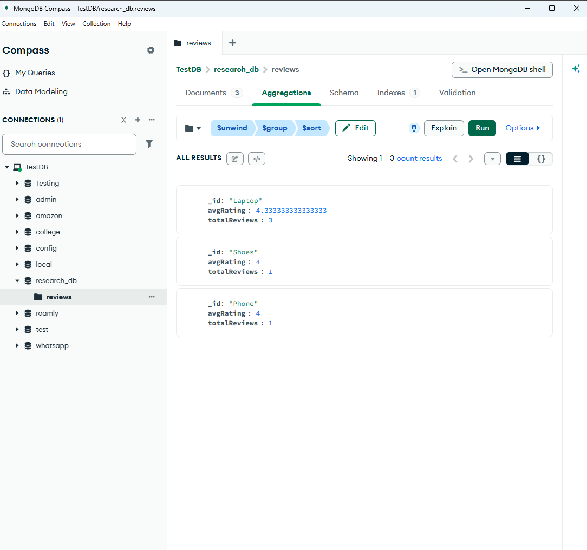

# Query Optimization and Data Processing using SQL and MongoDB

## 📌 Overview
This project analyzes query performance and data processing techniques in both relational (MySQL) and semi-structured (MongoDB) database systems, with a focus on indexing and aggregation.

---

## 🛠️ Technologies Used
- MySQL (Relational Database)
- MongoDB (NoSQL Database)
- MongoDB Compass

---

## 🔹 MySQL Implementation

### Database Design
- Created normalized tables: customers, products, orders
- Established relationships using foreign keys

### Query Processing
- Performed JOIN operations
- Used GROUP BY for aggregation
- Executed nested queries

### 🔥 Query Optimization
- Used `EXPLAIN` to analyze query execution
- Before indexing:
  - No index used (key: NULL)
  - Full table scan
- After indexing:
  - Index used (key: idx_customer)
  - Faster lookup using indexed access (type: ref)

---

## 🔹 MongoDB Implementation

### Data Modeling
- Stored semi-structured JSON documents
- Used nested arrays for product reviews

### Querying
- Retrieved documents using:
```json
{ "reviews.rating": { "$gte": 4 } }

  ## 📊 Results and Observations

### MySQL Query Optimization
- Before indexing:
  - Query performed full table scan (key: NULL)
- After indexing:
  - Query used index (key: idx_customer)
  - Improved efficiency using indexed lookup (type: ref)

### MongoDB Query Behavior
- Query on nested fields executed without index
- Highlighted need for indexing in NoSQL systems as well

### Aggregation Output
- Computed average rating per product:
  - Laptop → ~4.33
  - Phone → 4
  - Shoes → 4

### 🔍 Ranking and Retrieval

- Implemented ranking of products based on average rating
- Used aggregation pipeline with $unwind, $group, and $sort
Simulates a basic information retrieval system by ranking items based on relevance (user ratings)

  ---


## 📸 Results Screenshots

### MySQL Optimization



### MongoDB Query (Without Index)


### MongoDB Aggregation Output


### Product Ranking (Information Retrieval Simulation)



---

## 🧠 Key Learnings

- Understood the importance of indexing in query optimization
- Analyzed execution plans using EXPLAIN in MySQL
- Learned how databases avoid full table scans using indexes
- Worked with semi-structured JSON data in MongoDB
- Applied aggregation pipelines ($unwind, $group) for data analysis


This project demonstrates how database systems support efficient querying and retrieval across both structured and semi-structured data environments.